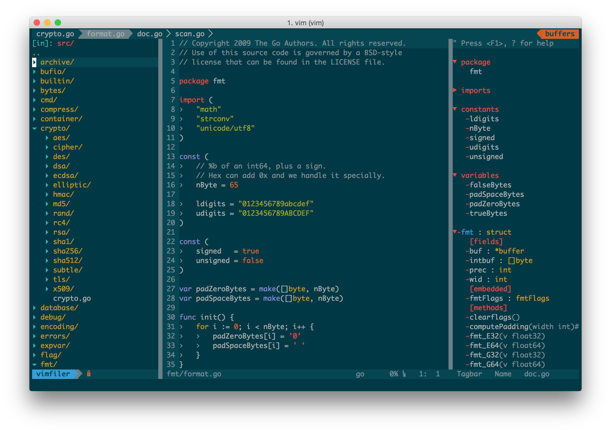

Vim for Mac
============

This is my *personal* vim bundle mainly for Mac, but it should also work on Linux/Unix with a little tweaks.


Prerequisites
=============


* Updated Vim Version
* Build Tools Supports

```sh
brew install cmake ctags
brew install --override-system-vi --with-lua --with-luajit vim
brew linkapps
```

Features
========
- NERDTree
- CtrlP
- Color Themes
- GIT (Fugitive)
- Ultisnips
- AutoComplete (NeoComplete)
- Supported Languages
    - Golang
    - Markdown
    - JSX
    - HAML
    - TypeScript


Install
=======

Run the following line from your terminal

```sh
curl -s https://raw.githubusercontent.com/jimzhan/.vim/master/setup | sh
```


Preview
=======




Key Mappings
============
* *jj*  as \<ESC\>
* *,*   as \<Leader\>
